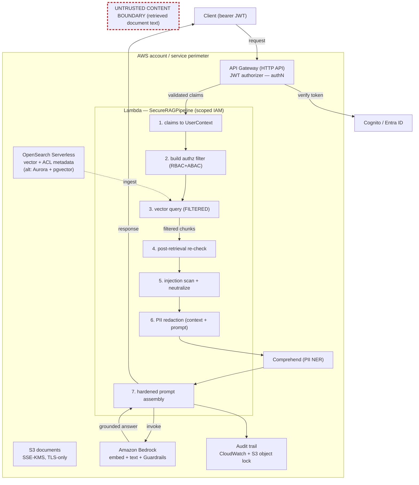

# Polyphemus — Reference Architecture

Polyphemus is a secure retrieval-augmented-generation (RAG) reference on Amazon
Bedrock. Security controls are first-class, observable outputs of the pipeline:
access control enforced at query time, PII redaction before model invocation,
indirect prompt-injection defense, and a complete audit trail.


> The SVG above is generated by `scripts/render_architecture.py` (pure Python, no
> network) and regenerated with `make render-diagram`. The GitHub-renderable
> Mermaid version of the same flow is embedded [below](#data-flow-mermaid).

---

## 1. Components

| Component | Role | Mock (offline) | AWS (reference) |
|---|---|---|---|
| **Identity Provider** | Issues/validates OIDC tokens; supplies groups, department, clearance claims | fixture users (`data/fixtures/users.json`) | Amazon Cognito or Microsoft Entra ID |
| **API Gateway (HTTP API)** | Public edge; validates the JWT (authentication) before invoking compute | n/a (claims injected directly) | HTTP API + JWT authorizer |
| **Lambda (pipeline)** | Runs the `SecureRAGPipeline` orchestrator under a scoped IAM role | in-process | AWS Lambda |
| **S3 (documents)** | Source document storage with object metadata | `MockS3` (in-memory) | S3 bucket, SSE-KMS, block public access, TLS-only policy, versioning |
| **Vector store** | Vector index carrying ACL metadata; filters at query time | `MockVectorStore` | **OpenSearch Serverless (primary)** — Aurora + pgvector documented as the alternate |
| **Bedrock** | Embeddings + text generation + Guardrails | `MockBedrock` (deterministic) | Amazon Bedrock Runtime |
| **Comprehend** | NER-grade PII detection | regex detectors | Amazon Comprehend `detect_pii_entities` |
| **Audit store** | Append-only evidence trail | JSONL file (`audit/audit.log`) | CloudWatch Logs + object-locked S3 audit bucket |

Every AWS dependency is obtained through `src/polyphemus/aws/clients.py`. Pipeline
code never imports `boto3`; the `POLYPHEMUS_MODE` env var selects mock vs real.

> **Mock-mode caveat.** In mock mode the model's *refusal to follow injected
> instructions* is simulated deterministically (see `MockBedrock` — an
> `if`-statement keyed off the defense sentinel). The scanner, neutralization,
> spotlighting, PII redaction, and output validation are real code exercised
> offline; the model's resistance is not. In production, resistance comes from
> prompt hardening + Bedrock Guardrails (`aws` mode). See
> [README → Limitations of mock mode](../README.md#limitations-of-mock-mode) and
> [`THREAT_MODEL.md`](THREAT_MODEL.md).

---

## 2. Data flow (numbered)

1. **Request** arrives at API Gateway with a bearer JWT.
2. **JWT validation** (authentication) — the API Gateway JWT authorizer verifies
   the token signature, issuer, and audience. Invalid tokens never reach compute.
3. **Claims → UserContext** — `authz/identity.py` maps Cognito/Entra claims into a
   `UserContext` (subject, groups, department, clearance), failing closed on
   missing/invalid clearance.
4. **Build authz filter** — `authz/query_filter.py` produces an OpenSearch-style
   bool filter from the user's groups and clearance (RBAC + ABAC).
5. **Vector query (filtered)** — `retrieval/retriever.py` queries the vector store
   **with** the filter, so unauthorized chunks are never returned (primary
   enforcement).
6. **Post-retrieval re-check** — every returned chunk is re-evaluated by
   `authz/policy.py`; anything not allowed is dropped and recorded in
   `denied_sources` (defense-in-depth).
7. **Injection scan + neutralize** — `defense/injection.py` scans the untrusted
   context for override/role-switch/exfiltration/encoded payloads, records the
   fired rules, and neutralizes control sequences (spotlighting the context).
8. **PII redaction** — `redaction/redactor.py` scrubs PII from the retrieved
   (now-neutralized) context **and** the user prompt, emitting `RedactionEvent`s.
9. **Prompt assembly** — `defense/system_prompt.py` builds a hardened system
   prompt that declares the (spotlighted, nonce-fenced) context to be untrusted
   data, not instructions.
10. **Bedrock** — `generation/bedrock_client.py` invokes the model to produce a
    grounded answer; the model refuses instructions embedded in context.
11. **Output validation** — the response is re-scanned by `redaction/redactor.py`
    and checked for the system-prompt canary before it leaves the pipeline; any
    late leak is scrubbed and flagged (defense-in-depth on the output side).
12. **Audit write** — `audit/logger.py` appends one JSONL `AuditRecord` with the
    full security story.
13. **Response** returns to the caller.

<a name="data-flow-mermaid"></a>

### Data flow (Mermaid)



---

## 3. Trust boundaries

| Boundary | Between | Why it matters |
|---|---|---|
| **Internet ↔ API Gateway** | untrusted callers ↔ the edge | authentication happens here (JWT authorizer); nothing downstream trusts unauthenticated input |
| **API Gateway ↔ Lambda** | edge ↔ compute | only validated, claim-bearing requests cross; Lambda derives identity solely from verified claims |
| **Lambda ↔ Bedrock / OpenSearch / S3** | compute ↔ managed services | traversed with scoped IAM (least privilege); model ARNs and bucket/collection are constrained |
| **Untrusted-content boundary** | retrieved document text ↔ the model | retrieved chunks are attacker-influenceable data; the injection defense (spotlighting + neutralization + data/instruction separation) lives exactly here |

The untrusted-content boundary is the subtle one: even *authorized* documents may
contain adversarial instructions (see `data/documents/malicious/`). Content that
crosses this boundary is always treated as data, never as commands.

For the assets, adversaries, in/out-of-scope boundaries, and known residual risks
(including the mock-mode and homoglyph caveats), see
[`THREAT_MODEL.md`](THREAT_MODEL.md).

---

## 4. Security controls mapped to pipeline stage

| Control class | Control | Pipeline stage / module | Evidence in `AuditRecord` |
|---|---|---|---|
| Authentication | JWT/OIDC validation | API Gateway authorizer → `authz/identity.py` | `user` (subject, idp) |
| Authorization | Query-time metadata filter | `authz/query_filter.py` + vector store | `retrieved_sources` |
| Authorization | Post-retrieval re-check (defense-in-depth) | `authz/policy.py` in `retrieval/retriever.py` | `policy_decisions`, `denied_sources` |
| Confidentiality | PII redaction (context + prompt) | `redaction/` | `redactions` |
| Confidentiality | Encryption at rest / in transit | S3 SSE-KMS, TLS-only (IaC) | (infrastructure) |
| Integrity | Prompt-injection defense | `defense/injection.py`, `defense/system_prompt.py` | `injection_flags` |
| Accountability | Structured audit trail | `audit/logger.py` | entire record |
| Least privilege | Scoped IAM roles | `iac/terraform/modules/*`, `iac/cdk/stacks/*` | (infrastructure) |

See [`SECURITY_CONTROLS.md`](SECURITY_CONTROLS.md) for the OWASP LLM Top 10 and NIST
mappings, and [`ACCESS_CONTROL.md`](ACCESS_CONTROL.md) for the ABAC/RBAC model.

---

## 5. Alternate vector store: Aurora PostgreSQL + pgvector

OpenSearch Serverless is the primary vector store. The same query-time filtering
is expressible in Aurora + `pgvector`:

```sql
SELECT chunk_id, source_uri, text,
       1 - (embedding <=> :query_vec) AS score
FROM   chunks
WHERE  allowed_groups && ARRAY[:user_groups]::text[]   -- RBAC group intersection
  AND  classification_rank <= :user_clearance_rank      -- ABAC clearance
ORDER  BY embedding <=> :query_vec
LIMIT  :top_k;
```

**Trade-offs**

| | OpenSearch Serverless (primary) | Aurora + pgvector (alternate) |
|---|---|---|
| Ops model | serverless, auto-scaling | managed cluster / Serverless v2 |
| Filtering | native `bool.filter` metadata queries | SQL `WHERE` (arrays, ranges) |
| Familiarity | search-native | SQL-native, transactional joins |
| Best when | large corpora, search features | you already run Postgres, need joins/txns |

Both enforce the *same* access-control semantics at query time; only the filter
syntax differs.
